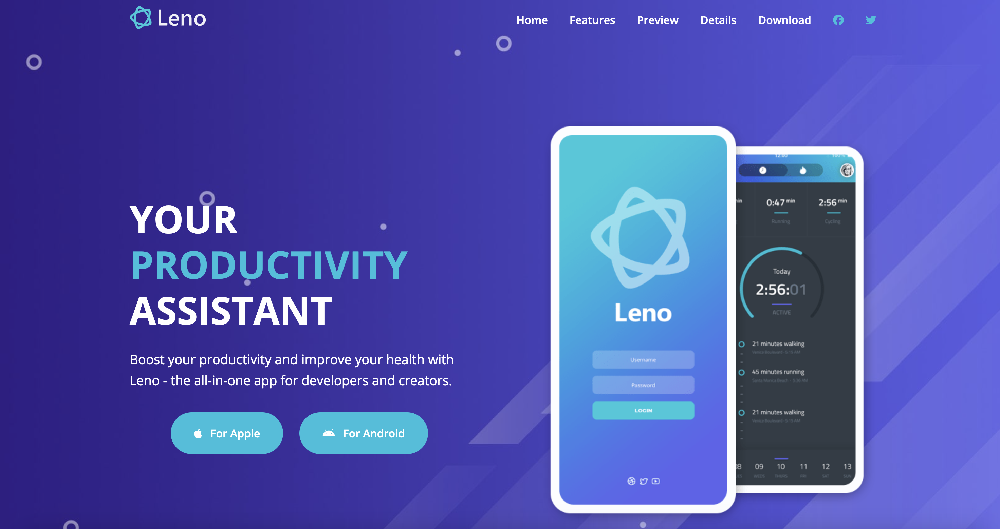

# Leno Website - Productivity & Health App Landing Page

A sleek and modern landing page for the Leno app, designed to showcase its features, benefits, and testimonials. This responsive website is perfect for promoting productivity and health-focused applications, providing users with a visually appealing and engaging experience.

## Features

- **Hero Section**: Captivating introduction with a call-to-action for downloading the app.
- **Testimonials**: Highlights user success stories with visually appealing cards.
- **Key Features**: Showcases the app's powerful features, including real-time data, calendar integration, and a visual editor.
- **Preview Section**: Offers a sneak peek of the app's interface with images and videos.
- **Details Section**: Provides in-depth information about the app's functionality and benefits.
- **Screenshots Gallery**: Displays multiple screenshots of the app for better visualization.
- **Download Section**: Includes buttons for downloading the app on Apple and Android devices.
- **Responsive Design**: Fully optimized for desktop, tablet, and mobile devices.
- **Social Media Integration**: Links to popular social platforms for easy sharing.

## Technologies Used

- HTML
- CSS
- JavaScript
- Font Awesome for icons
- Google Fonts for typography

## How to Use

- Clone the repository.
- Open `index.html` in your browser.
- Explore the landing page to view its features and design.
- Customize the content, styles, and scripts to fit your app's branding.
